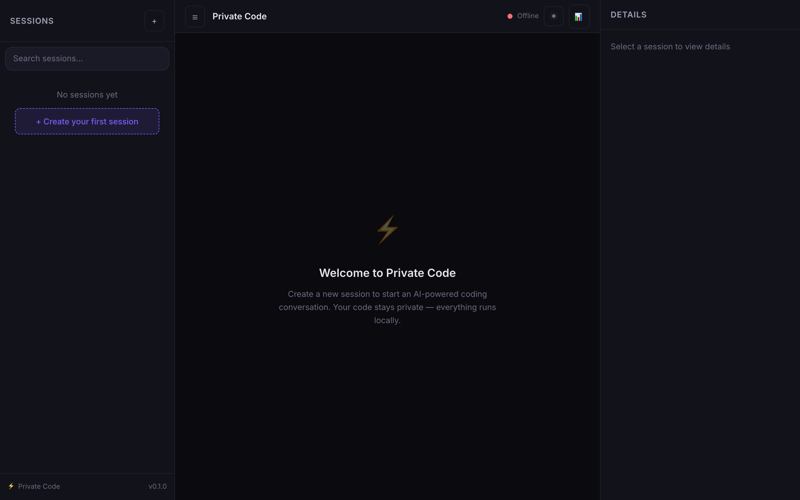
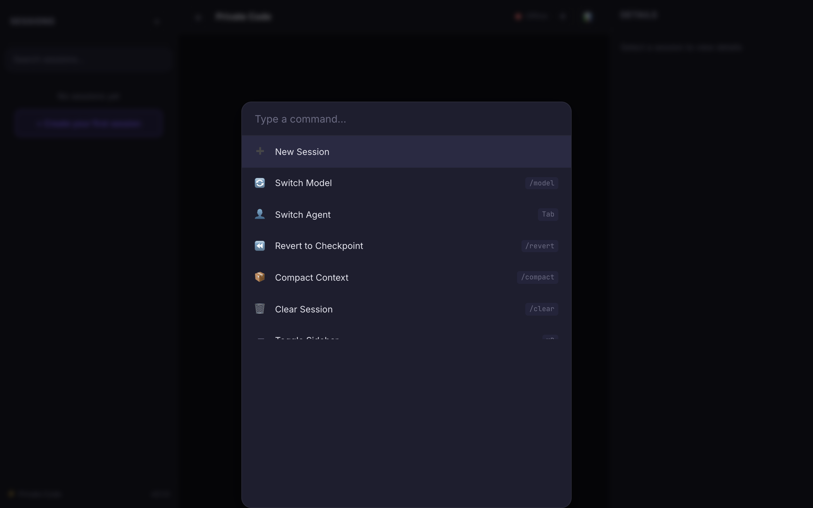

# Private Code

> **One-line pitch:** A native, instant, local-first AI coding agent — terminal *and* GUI — with first-class multi-model orchestration, git-backed checkpoints, and high-performance code intelligence.

Private Code is a **Rust core engine** that powers a terminal TUI, a Tauri 2 desktop GUI, and a headless loopback daemon for editor integration. It is **not** a hosted service: sessions and indexes live on your machine; you bring your own API keys (BYOK) or run local models (Ollama, LM Studio).

**Status:** Pre-1.0. See [PROGRESS.md](PROGRESS.md) for implementation honesty and [RELEASE_PUNCHLIST.md](RELEASE_PUNCHLIST.md) for release blockers. Automated tests use mocked providers; live BYOK smoke tests require your keys.

---

## Quick start

### Install the CLI (release binary)

After the first GitHub Release is published:

```bash
curl -fsSL https://raw.githubusercontent.com/CBaileyDev/PrivateCode/main/scripts/install.sh | bash
```

Pin a version and verify SHA256 when available:

```bash
PRIVATE_CODE_VERSION=v0.1.0 ./scripts/install.sh
```

Windows: download `private-code-x86_64-pc-windows-msvc.exe` from [GitHub Releases](https://github.com/CBaileyDev/PrivateCode/releases).

### Build from source

**Prerequisites**

| Component | Requirement |
|---|---|
| Rust | `stable` (see `rust-toolchain.toml`) — `rustfmt`, `clippy` |
| Desktop GUI | Node.js 20+ (CI uses 22), npm |
| Linux desktop | `libwebkit2gtk-4.1-dev`, `libappindicator3-dev`, `librsvg2-dev`, `patchelf`, `libssl-dev` |
| macOS desktop | Xcode CLT; icons in `apps/desktop/src-tauri/icons/` |
| Windows desktop | WebView2 (usually preinstalled) |

```bash
# 1. Frontend dist (required before compiling the Tauri crate)
cd apps/desktop && npm ci && npm run build && cd ../..

# 2. CLI + engine
cargo build --release --locked -p private-code-cli

# 3. Offline engine smoke (no API key)
cargo run -p private-code-cli -- selftest

# 4. Desktop GUI (dev)
cd apps/desktop && npm run app
```

Agent/CI dev details: [AGENTS.md](AGENTS.md).

---

## Usage

### Headless daemon (TUI / automation / editor attach)

```bash
# Serve on loopback :48123 (token at ~/.local/share/private-code/daemon_token)
private-code serve --port 48123

# Interactive TUI (auto-starts daemon if needed)
private-code tui --workspace /path/to/your/repo

# One-shot prompt
private-code prompt "Summarize this repo" --workspace .
```

REST/WebSocket/SSE require `Authorization: Bearer <token>`. See [specs/api_protocol.md](specs/api_protocol.md).

### Desktop GUI

```bash
cd apps/desktop && npm run app
```

1. **Settings (gear / Cmd+,)** — paste provider API keys (stored in OS keychain).
2. **Open a folder** — creates a project + session rooted in that directory.
3. Pick a **model** in the composer → send a message.

Packaged bundles: `npm run app:build` (unsigned unless signing secrets are configured; see `release.yml`).

### Provider keys (BYOK)

```bash
private-code auth set anthropic    # prompts securely; never echoed
private-code auth list
private-code auth remove anthropic
```

Or set env vars: `ANTHROPIC_API_KEY`, `OPENAI_API_KEY`, `GOOGLE_API_KEY`, etc.

**Local inference:** [Ollama](https://ollama.com) (`localhost:11434`) and LM Studio (`localhost:1234`) are auto-detected when running.

---

## What ships today (honest matrix)

| Feature | Status |
|---|---|
| Single-model agent loop + tools (read/write/edit/bash/grep/patch) | ✅ |
| Git-backed checkpoints + revert | ✅ (revert latest checkpoint in GUI; arbitrary checkpoint restore deferred) |
| Desktop GUI (sessions, settings, model picker, streaming) | ✅ |
| Multi-model fan-out / role pipelines | ✅ (answer-only — no tool loop in fan-out) |
| Code intelligence (tree-sitter, FTS5, nucleo, repo map) | ✅ |
| Daemon + TUI + headless `prompt` | ✅ |
| LSP post-write diagnostics | ✅ partial — needs local language servers installed; daemon roots LSP at launch CWD (per-session rooting deferred) |
| MCP tools (stdio) | ✅ when configured; HTTP MCP transport deferred |
| WASM plugins | ⚠️ loaded but hooks not wired into orchestrator (deferred) |
| Signed installers / auto-update | ⚠️ `release.yml` builds artifacts; signing is optional; `private-code update` is check-only |
| Homebrew / Scoop / AUR | ❌ post-first-release |

---

## Architecture

```
cli/                 # private-code binary (serve | tui | prompt | selftest | auth)
crates/
  core/              # engine: orchestrator, sessions, SQLite, checkpoints, indexing
  daemon/            # axum HTTP + WebSocket + SSE (loopback, bearer token)
  tui/               # ratatui client
  providers/         # Anthropic, OpenAI-compat, Google, …
  tools/             # agent tools
  lsp/, mcp/, plugins/
apps/desktop/        # Tauri 2 + Solid.js GUI
specs/               # protocol, security, database specs
```

**Stack:** Rust (`tokio`, `axum`, `sqlx`/SQLite, `git2`, `tree-sitter`) · Tauri 2 · Solid.js + Vite · Virtua virtualization · Shiki (web worker).

---

## Development

```bash
# Quality gate (matches CI)
cargo fmt --all -- --check
cargo clippy --workspace --all-targets --locked -- -D warnings
cargo nextest run --workspace --locked
cd apps/desktop && npm run typecheck && npm run build && npm run test
```

**Releases:** push a tag `v*` → `.github/workflows/release.yml` builds CLI binaries for macOS (arm64/x64), Linux (x64/arm64), and Windows, plus best-effort desktop bundles.

---

## UI preview

| Welcome screen (dark) | Command palette (⌘K) |
|:---:|:---:|
|  |  |

---

## License

Licensed under the [Apache License, Version 2.0](LICENSE).
